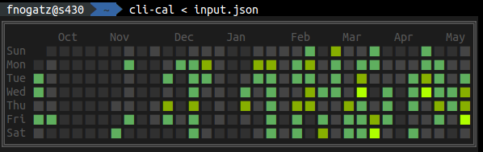

# cli-cal

Github-like calendar graph for the command line.

**Deprecated:** Use [cli-gh-cal](https://github.com/IonicaBizau/cli-gh-cal) instead.

This module has been created as an extract of [git-stats](https://github.com/IonicaBizau/git-stats). In the meantime ([#49](https://github.com/IonicaBizau/git-stats/issues/49#issuecomment-119532161)) [Ionică Bizău](https://github.com/IonicaBizau) created the standalone package [cli-gh-cal](https://github.com/IonicaBizau/cli-gh-cal) which should be used instead of this package.



## Installation

```bash
npm install -g cli-cal
```

## Usage

Simply specify a list or object of entities:

```bash
echo '[["2013/07/30",2],["2013/08/31",4],["2013/11/11",3],["2014/03/01",2]]' | cli-cal

echo '{ "2013/07/30": 2, "2013/08/31": 4, "2013/11/11": 3, "2014/03/01": 2 }' | cli-cal
```

The given entities can be of any range and floats too. They will be normalized and mapped to five levels.

For example you can pipe [clocker](https://github.com/substack/clocker)'s output into `cli-cal` after some [json](https://github.com/trentm/json) magic:

```bash
clocker data | \
  json -a hours | \
  json -e 'this.n = [[this.date.replace(/-/g,"/"),this.hours]]' -a n | \
  json -g | \
  cli-cal
```

## Credits

Most of the module is a generalized extract of [git-stats](https://github.com/IonicaBizau/git-stats) by [Ionică Bizău](https://github.com/IonicaBizau).
